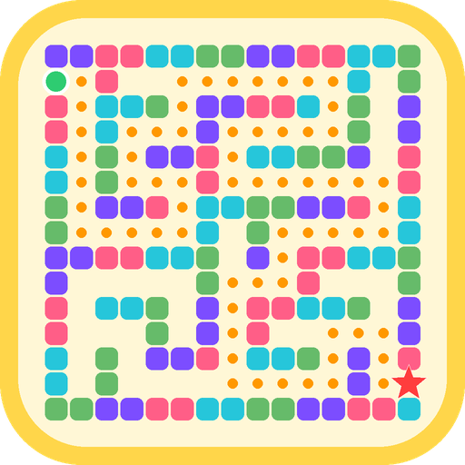

<p align="center"></p>

# Random Maze

A Minecraft Bedrock add-on that builds a **brand-new maze every time** you use it, with secret doors, hidden traps and a timer. Made by **Dragão e Guaxinim**.

Website: https://randommaze.epifania.co

## Features

- A different maze every time, always with a way out. Default 41x41, from 15x15 up to 61x61.
- 16 secret doors (mossy cobblestone). Step on the pressure plate next to one and it opens for 8 seconds.
- Every 90 seconds, two doors open or close by themselves.
- 10 hidden traps: slowness, darkness, or back to the start. None of them cause damage.
- Timer: when a player reaches the exit, their time is announced in chat.

## Requirements

- Minecraft **Bedrock** Edition 1.21.60 or newer (tested on 26.52, Android). Does not work on Java Edition.
- Cheats enabled in the world. No experiments needed.
- Multiplayer: only the host installs the pack.

## Install

1. Download `RandomMaze.mcpack` from the [Releases](../../releases) page.
2. Open it with Minecraft, or in Minecraft go to **Settings → Storage → Import**.
   On some Android phones (e.g. Samsung), the built-in file manager can't open it; use a file manager such as File Manager+ and choose Minecraft.
3. Edit your world → **Behavior Packs → Available** → activate **Random Maze**, and turn on **Cheats**.

## Commands

| Command | What it does |
| --- | --- |
| `/function maze` | Builds a new 41x41 maze around you |
| `/scriptevent maze:new 25` | Builds a maze of the size you choose (15 to 61) |
| `/scriptevent maze:test` | Checks that the pack is running |

> The command clears the area around you (about 20 blocks in each direction). Use it on open ground or in a flat world.

## Development

The pack source is in [`pack/`](pack). It uses only stable Script API events (`@minecraft/server` 1.17.0), so it runs without Beta APIs.

```sh
npm test        # maze generator checks + full simulation against a mock Minecraft API
npm run build   # creates dist/RandomMaze.mcpack
```

- `pack/scripts/maze.js` — maze generator (pure JS, no Minecraft APIs).
- `pack/scripts/main.js` — building, doors, traps, timer.
- `tools/` — tests, mock API and build script.

## License

Free to play and to show in videos and streams (a link to the website in your description is appreciated). You may not sell this add-on or re-upload the file to other sites. See [LICENSE](LICENSE).

Not an official Minecraft product. Not approved by or associated with Mojang or Microsoft.
